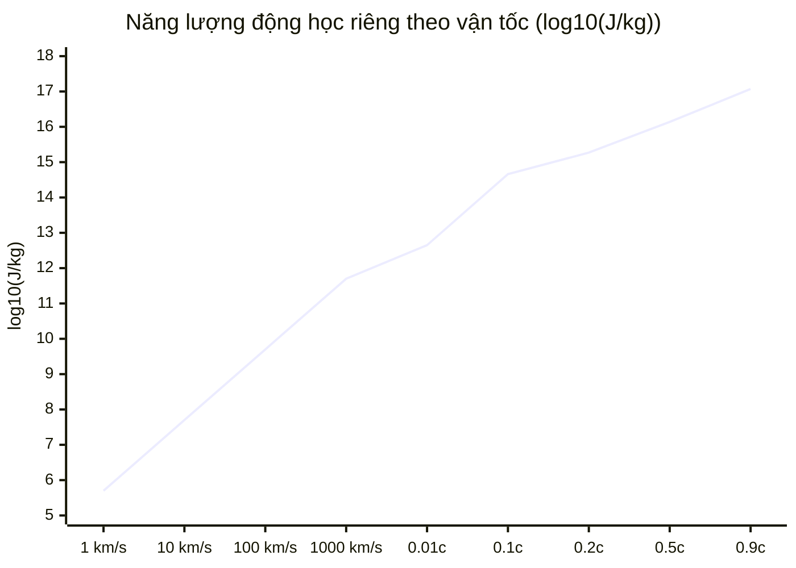
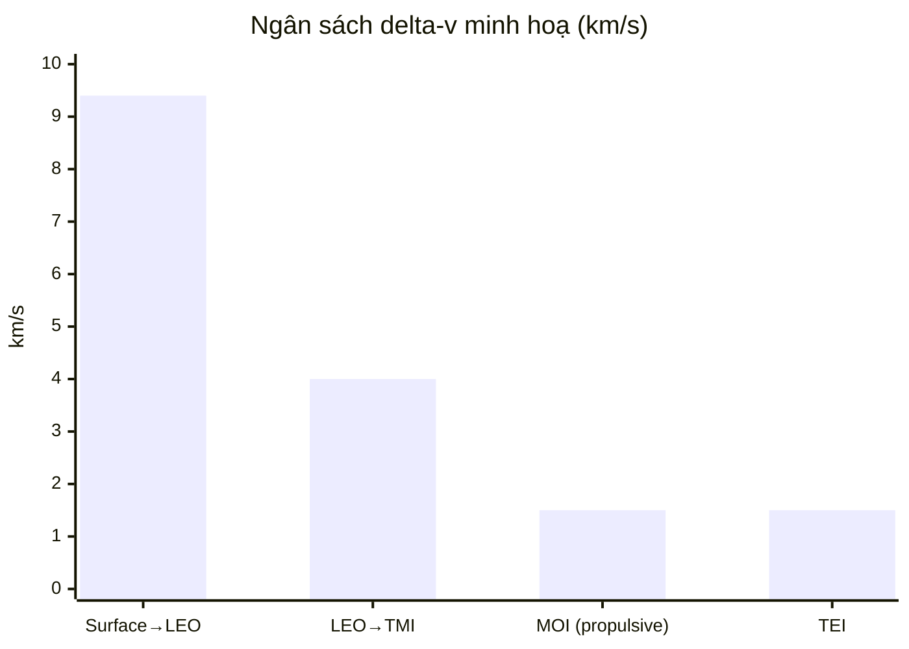
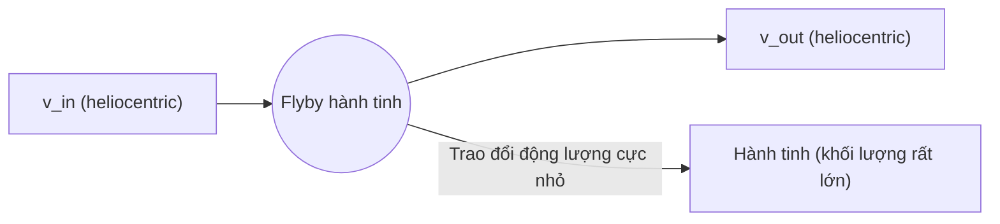
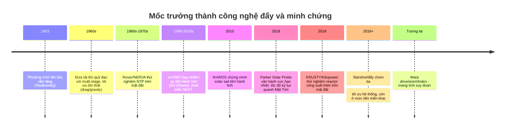

# Ràng buộc và công nghệ cho du hành liên hành tinh và liên sao

## Tóm tắt điều hành

Du hành **liên hành tinh** hiện nay là bài toán “tối ưu hoá quỹ đạo + tối ưu hoá khối lượng/nhiên liệu + ràng buộc kỹ thuật”, và về nguyên lý đã khả thi với công nghệ đẩy hoá học, điện (ion/Hall), cùng các thủ thuật quỹ đạo như **Hohmann**, **trợ lực hấp dẫn**, **Oberth** và **khí động học (aerobrake/aerocapture)**. Báo cáo kiến trúc tham chiếu của entity["organization","NASA","us space agency"] cho các nhiệm vụ người lái đến entity["place","Hỏa Tinh","mars planet"] cho thấy ngân sách ∆v liên hành tinh điển hình (tính từ quỹ đạo chờ LEO ~407 km) có thể ở mức vài km/s cho từng pha như TMI/MOI/TEI, và tổng ∆v liên hành tinh cho nhiệm vụ “conjunction-class” thường thấp hơn nhiệm vụ “opposition-class”, đồng thời thời gian bay một chặng thường cỡ vài trăm ngày. citeturn30view1turn29view0

Du hành **liên sao** lại bị “khóa cứng” bởi hai luật phạt cực mạnh: (1) năng lượng động học tăng rất nhanh theo vận tốc (xấp xỉ ∝ v² ở miền phi tương đối tính; và tăng siêu tuyến tính khi tiến gần vận tốc ánh sáng), và (2) phương trình tên lửa Tsiolkovsky khiến **tỷ số khối lượng** tăng theo **hàm mũ** của ∆v đối với tên lửa tự mang phản lực. Vì vậy, các công nghệ “đẩy phản lực” cổ điển (hoá học, thậm chí nhiệt hạch/hạt nhân) khó mở rộng lên 0.1c–0.2c cho tàu lớn, trừ khi có đột phá về vật lý, vật liệu, hoặc chuyển sang **đẩy được cấp năng lượng từ bên ngoài** (ví dụ: **buồm ánh sáng + laser công suất rất lớn**). citeturn21view0turn2search1turn44search2

Các mốc “state-of-the-art” hiện nay minh hoạ thẳng thắn khoảng cách giữa liên hành tinh và liên sao: tàu nhanh nhất theo vận tốc quỹ đạo quanh entity["place","Mặt Trời","sun star"] như Parker Solar Probe đạt cỡ ~700,000 km/h (~430,000 mph) ở cận nhật, tức ~191 km/s (~0.00064c), trong khi để tới hệ sao gần nhất ở ~4.2465 năm ánh sáng, ngay cả bay đều ở 191 km/s vẫn cần hàng ngàn năm. citeturn35search1turn21view0turn17search3

Về mặt kỹ thuật–hạ tầng, các nút thắt chính của hành trình xa (đặc biệt có người) gồm: quản lý nhiệt/độ bền (ví dụ lá chắn nhiệt chịu ~1377°C của Parker), bức xạ (GCR/SPE), truyền thông và độ trễ (đến Sao Hoả là phút; đến sao gần nhất là năm), vòng đời hệ thống hỗ trợ sự sống, và đặc biệt là **nhịp phóng + tiếp nhiên liệu/tiếp vận trong không gian** (cryogenic depot, ISRU). citeturn35search1turn10search8turn10search5turn10search7turn23search1

## Nền tảng vật lý và các giới hạn cơ bản

### Tốc độ ánh sáng và tương đối tính

Vận tốc ánh sáng trong chân không **c = 299,792,458 m/s** là hằng số cơ bản (được dùng để định nghĩa thang đo độ dài SI) và đồng thời xuất hiện như giới hạn vận tốc tiệm cận đối với vật có khối lượng nghỉ trong thuyết tương đối hẹp. citeturn21view0turn7search0

Hai hệ quả quan trọng cho du hành vũ trụ tốc độ cao:

- Ở vận tốc “thấp” so với c (v ≪ c), năng lượng động học xấp xỉ **Eₖ ≈ ½ m v²** nên khi bạn muốn nhanh gấp 10 lần, năng lượng cần tăng ~100 lần.
- Khi tiến vào miền tương đối tính, năng lượng cần thiết tăng theo **Eₖ = (γ − 1) m c²** với γ = 1/√(1 − v²/c²), khiến chi phí năng lượng và yêu cầu che chắn/va chạm tăng rất nhanh khi v → c. citeturn21view0turn7search1

### Định luật tỉ lệ năng lượng theo vận tốc

Để thấy độ “phạt v²” khốc liệt thế nào, bảng dưới cho **năng lượng động học riêng** (J/kg) ở vài mức vận tốc tiêu biểu (đã dùng công thức tương đối tính để nhất quán ở miền cao):



Các điểm dữ liệu này “neo” vào định nghĩa c và thời gian–độ dài chuẩn trong tài liệu tham số thiên văn/động lực học của entity["organization","Jet Propulsion Laboratory","nasa center"] (JPL/SSD), nơi cũng cung cấp light-time cho 1 AU và các hằng số động lực học liên quan. citeturn21view0

Hệ quả trực tiếp: liên sao với vận tốc hành trình 0.1c–0.2c đòi hỏi năng lượng ở cấp **10¹⁴–10¹⁵ J/kg**, tức chỉ riêng động năng (chưa tính hiệu suất) cho 10 tấn tải cũng ở thang **exa-joule**. Điều này giải thích vì sao muốn “đi nhanh” trong không gian sâu không thể chỉ dựa vào trực giác “cứ thêm nhiên liệu là được”. citeturn21view0

## Động lực học quỹ đạo, thoát hấp dẫn và ngân sách delta‑v

### Vận tốc quỹ đạo thấp và vận tốc thoát

Trong cơ học quỹ đạo, ta thường làm việc với **tham số hấp dẫn chuẩn GM**. entity["organization","Jet Propulsion Laboratory","nasa center"] công bố GM cho các thiên thể theo DE440/DE441; ví dụ Earth GM ~398600 km³/s² (đơn vị km³/s² trong bảng). citeturn21view0

Từ đó, vận tốc quỹ đạo tròn LEO cỡ vài trăm km có bậc ~7.7–7.8 km/s là kết quả trực tiếp của v = √(μ/r). Trong một tài liệu giảng giải tên lửa/đưa tải lên quỹ đạo của entity["organization","NASA","us space agency"], ví dụ quỹ đạo ~100 dặm (≈160 km) có vận tốc tròn ~25,750 ft/s (~7.85 km/s). citeturn39view0

Vận tốc thoát khỏi hấp dẫn Trái Đất tại bề mặt ~11.2 km/s là một con số chuẩn hay được trích trong tài liệu giáo dục của NASA. citeturn2search0

Điểm quan trọng: **vận tốc thoát 11.2 km/s không đồng nghĩa “đưa lên quỹ đạo cần 11.2 km/s”**. Đưa lên LEO chủ yếu cần đạt vận tốc quỹ đạo ngang ~7.8 km/s, cộng thêm tổn thất do kéo khí động, trọng lực, điều khiển hướng bay…

### Tổn thất khi phóng lên quỹ đạo

Cùng tài liệu NASA nói trên nêu rõ: để áp dụng “rocket equation lý tưởng” cho bài toán lên quỹ đạo, phải cộng các tổn thất, và “kinh nghiệm cho thấy” tổng tổn thất điển hình để lên quỹ đạo có thể cỡ **~4000 ft/s** (~1.2 km/s) trong mô hình minh hoạ (tuỳ quỹ đạo, profile bay, khí quyển, T/W…). citeturn39view0

Trong thực tế hiện đại, khi tính “delta‑v từ mặt đất lên LEO”, cộng thêm drag + gravity + steering thường cho ra cỡ **~9–10 km/s** như một quy tắc thiết kế bậc một; nhưng con số cụ thể phụ thuộc mạnh vào kiến trúc phóng, quỹ đạo mục tiêu, vĩ độ bãi phóng và tối ưu điều khiển. citeturn39view0turn27search6

### Ngân sách ∆v điển hình cho Trái Đất → LEO → chuyển tiếp → Sao Hoả

Báo cáo kiến trúc tham chiếu Mars DRA 5.0 của NASA tách rõ các pha ∆v liên hành tinh (tính từ quỹ đạo lắp ráp ~407 km) như **TMI (trans‑Mars injection)**, **MOI (Mars orbit insertion)**, **TEI (trans‑Earth injection)** và cho thấy chúng biến thiên theo “cửa sổ phóng” từng năm cơ hội. citeturn30view1turn29view0

Một biểu đồ ngân sách ∆v bậc một (để thuyết trình) có thể được trình bày như sau (giá trị đại diện, nhấn mạnh tính xấp xỉ):



Trong đó:
- “Surface→LEO ~9.4 km/s” là mức thường dùng để minh hoạ cho lên quỹ đạo thấp khi đã tính tổn thất; NASA có ví dụ tổn thất cỡ 4000–4250 ft/s cộng vào vận tốc quỹ đạo để ra “ideal velocity capability” cho bài toán minh hoạ. citeturn39view0turn27search6  
- TMI/MOI/TEI bám theo các mức thể hiện trong Figure 4‑2 của Mars DRA 5.0 (TMI thường quanh vài km/s; MOI và TEI cỡ ~1–2 km/s tuỳ năm/case). citeturn30view1

Ngoài ra, chính Mars DRA 5.0 nhấn mạnh: **aerocapture/aerobrake** có thể giúp giảm hoặc loại bỏ propellant cho MOI trong một số cấu hình (đổi lại tăng ràng buộc nhiệt/EDL và phức tạp TPS). citeturn30view0turn30view1

## Phương trình tên lửa Tsiolkovsky và ví dụ định lượng

### Dẫn xuất (tóm tắt nhưng chặt)

Xét tên lửa trong không gian (không lực ngoài), khối lượng thay đổi do phụt phản lực. Bảo toàn động lượng cho một phần tử thời gian dt:

- Trước: khối lượng m, vận tốc v.
- Sau: tên lửa còn m − dm, vận tốc v + dv; khối khí dm bị phụt ngược với vận tốc tương đối vₑ (tức vận tốc tuyệt đối của khí xấp xỉ v − vₑ).

Bảo toàn động lượng (bỏ bậc hai nhỏ) dẫn đến:
\[
m\,dv = v_e\,dm
\]
với dm < 0 (khối lượng giảm), nên:
\[
dv = -v_e\, \frac{dm}{m}
\]
Tích phân từ m₀ đến m_f:
\[
\Delta v = v_e \ln\left(\frac{m_0}{m_f}\right)
\]
Với vₑ = g₀ I_sp:
\[
\Delta v = g_0 I_{sp}\ln\left(\frac{m_0}{m_f}\right)
\]
Đây là phương trình Tsiolkovsky, được entity["organization","NASA","us space agency"] trình bày trong tài liệu về “Rocket Equation” và là nền tảng cho mọi phân tích mass fraction/∆v của tên lửa. citeturn2search1turn39view0

### Hệ quả “hàm mũ” và vì sao có giới hạn

Trong phương trình trên, ∆v tăng **tuyến tính theo Isp**, nhưng tăng **logarithm** theo (m₀/m_f). Đảo lại, để đạt ∆v lớn với Isp cố định, tỷ số khối lượng phải tăng theo **hàm mũ**:
\[
\frac{m_0}{m_f} = \exp\left(\frac{\Delta v}{g_0 I_{sp}}\right)
\]
Hệ quả này chính là “giới hạn” cứng khiến liên sao bằng rocket tự mang phản lực trở nên phi thực tế ở vận tốc lớn: chỉ cần tăng ∆v thêm vài km/s đã làm mass ratio tăng mạnh, và ở miền liên sao (hàng nghìn–chục nghìn km/s) thì trở thành khổng lồ. citeturn2search1turn21view0

### Ví dụ định lượng với tải 10 t và 20 t

Giả sử một tầng đẩy thực hiện **∆v = 4.0 km/s** (xấp xỉ một pha TMI điển hình từ LEO theo Mars DRA) và ta dùng Isp đại diện:

- Hoá học LH2/LOX (vacuum) ~450 s (cỡ RS‑25/J‑2/động cơ hydrolox),  
- Hoá học storable/hydrocarbon ~320 s (đại diện),  
- Nhiệt hạch hạt nhân NTP ~800–1000 s.  

Các dải Isp này phù hợp với bảng so sánh “chemical vs advanced propulsion” trong một tổng quan NTP của NASA (vacuum Isp: RS‑25 ~452 s; ion NEP 2000–8000 s; NTP 800–1000 s; và NERVA thực nghiệm đạt ~825–875 s). citeturn42view0turn42view1

Để tránh sa vào chi tiết kết cấu từng tầng, ta minh hoạ theo mô hình đơn giản: khối lượng “khô” của tầng (tank/engine) bằng **10%** khối lượng propellant (m_dry = 0.1 m_prop), tương tự kiểu giả định minh hoạ trong tài liệu NASA về tính toán lên quỹ đạo. citeturn39view0

| Tham số | Isp ~320 s | Isp ~450 s | NTP Isp ~900 s |
|---|---:|---:|---:|
| Mass ratio m₀/m_f cho ∆v=4 km/s | ~3.58 | ~2.48 | ~1.57 |
| Propellant cần cho payload 10 t (m_dry=0.1 m_prop) | ~34.7 t | ~17.3 t | ~6.5–6.9 t* |
| Propellant cần cho payload 20 t (m_dry=0.1 m_prop) | ~69.4 t | ~34.6 t | ~13–14 t* |

\* Với NTP, phần “dry mass” (reactor/shielding) thường **không** nhẹ như 10% propellant; vì vậy con số NTP ở đây là lạc quan nếu giữ mô hình khô=10%. Nếu tăng m_dry/m_prop lên 0.2–0.3 (hay hơn), khối lượng tăng đáng kể dù vẫn lợi về Isp. Các bài tổng quan NASA về NERVA cho thấy NTP có thrust-to-weight và yêu cầu hệ thống phức tạp hơn hoá học. citeturn42view1turn42view0

**Thông điệp seminar**: chỉ một pha 4 km/s đã tạo khác biệt “gấp đôi” propellant giữa Isp 450 và 320; và ở ∆v lớn hơn (ví dụ tổng liên hành tinh ~7 km/s), khối lượng tăng cực mạnh theo hàm mũ. Điều này liên hệ trực tiếp với nhận xét trong Mars DRA rằng tổng ∆v liên hành tinh thay đổi theo chu kỳ synodic và chi phối mạnh thiết kế phương tiện. citeturn29view0turn30view1

## Phương pháp chuyển quỹ đạo và tối ưu ∆v

### Hohmann và chuyển tiếp hai xung

Chuyển quỹ đạo Hohmann là nghiệm tối ưu ∆v (cho quỹ đạo tròn đồng phẳng, xung tức thời) giữa hai bán kính quỹ đạo. Trong bài học của JPL/NASA về “Back to Mars”, thời gian bay Hohmann entity["place","Trái Đất","earth planet"]→Sao Hoả thường được minh hoạ khoảng **259 ngày**. citeturn3search6

Sơ đồ “patched-conic” tối giản cho Earth→Mars:

```mermaid
flowchart LR
    A[LEO (parking orbit)] -->|Burn: TMI| B[Quỹ đạo chuyển tiếp quanh Mặt Trời]
    B -->|Coast ~ 6–9 tháng| C[Đi vào SOI Sao Hỏa]
    C -->|MOI (đốt) hoặc aerocapture| D[Quỹ đạo Sao Hỏa / EDL]
```

Cách nhìn “patched conics” (ghép các đoạn quỹ đạo chịu chi phối bởi từng thiên thể) là phương pháp chuẩn trong thiết kế nhiệm vụ liên hành tinh; NASA có tài liệu kỹ thuật mô tả patched conics như một xấp xỉ hợp lý cho phần lớn mục đích thiết kế. citeturn16search11

### Bi‑elliptic và trade‑off ∆v–thời gian

Bi‑elliptic thêm một lần đốt (3 xung thay vì 2), có thể giảm ∆v so với Hohmann khi tỷ số bán kính quỹ đạo đủ lớn (kinh điển ~>11.94 trong mô hình chuẩn), nhưng **đổi lấy thời gian bay dài hơn nhiều**. Đây là một ví dụ quan trọng để nhấn mạnh: tối ưu ∆v không đồng nghĩa tối ưu thời gian—một trade-off luôn hiện hữu trong thiết kế nhiệm vụ. citeturn16search0

### Trợ lực hấp dẫn và “đòn bẩy” trên năng lượng quỹ đạo

Trợ lực hấp dẫn (gravity assist) thực chất là trao đổi động lượng với hành tinh khi xét trong hệ mặt trời: tàu đi vào “quả cầu ảnh hưởng” và rời ra với vector vận tốc heliocentric đổi hướng/đổi độ lớn. JPL mô tả gravity assist như kỹ thuật có thể “thêm hoặc bớt động lượng” để tăng/giảm năng lượng quỹ đạo, giúp đi xa hơn khả năng phóng trực tiếp của tên lửa. citeturn16search2

Sơ đồ khái niệm:



### Hiệu ứng Oberth và vì sao “đốt ở cận điểm” mạnh hơn

Hiệu ứng Oberth nói rằng cùng một ∆v (đốt động cơ), năng lượng quỹ đạo tăng được lớn hơn khi đốt tại nơi vận tốc đang cao (cận điểm/periapsis). Một nghiên cứu NASA về “two-burn maneuver” bàn sâu về việc tăng năng lượng hiệu quả khi đốt ở periapse và phân biệt nó với gravity assist. citeturn31view0

Đây là “thủ thuật” quan trọng trong các nhiệm vụ cần năng lượng thoát lớn (ra ngoài hệ Mặt Trời) hoặc khi kết hợp với flyby để khuếch đại kết quả. citeturn31view0turn16search2

image_group{"layout":"carousel","aspect_ratio":"16:9","query":["Hohmann transfer Earth Mars diagram","gravity assist spacecraft slingshot diagram","Oberth effect periapsis burn diagram"],"num_per_query":1}

## Công nghệ đẩy, hiệu năng và yêu cầu công suất

### Bức tranh tổng quan: Isp–lực đẩy–công suất

Có hai “trục” chính khi phân loại propulsion:

- **High-thrust / impulsive** (hoá học, NTP): đốt ngắn, thuận lợi cho Hohmann, TMI/MOI xung tức thời.
- **Low-thrust / continuous** (điện: ion/Hall/MPD/VASIMR; buồm): gia tốc nhỏ nhưng kéo dài, phù hợp tối ưu quỹ đạo kiểu liên tục và có thể tiết kiệm propellant. citeturn31view0turn43view0

Bảng dưới tổng hợp các lớp công nghệ theo các tham số “đủ để so sánh” (giá trị đại diện; thực tế phụ thuộc thiết kế cụ thể, công suất, vật liệu, profile bay).

| Lớp công nghệ | Nguyên lý | Isp (xấp xỉ) | Quy mô lực đẩy | Nguồn năng lượng | Điểm mạnh | Nút thắt kỹ thuật |
|---|---|---:|---|---|---|---|
| Hoá học rắn (SRB) | Đốt propellant rắn | ~240–270 s | MN | hoá năng | đơn giản, thrust lớn | Isp thấp, khó throttle/restart citeturn42view0 |
| Hoá học lỏng cryogenic (LH2/LOX) | Buồng đốt + nozzle | ~420–450+ s | kN–MN | hoá năng | Isp cao nhất trong hoá học | lưu trữ cryogenic/boil‑off, hạ tầng phức tạp citeturn42view0turn10search8 |
| Hoá học lỏng storable/hypergolic | MMH/N2O4… | ~300–340 s | N–kN | hoá năng | lưu trữ dễ, restart tốt | độc hại, Isp trung bình citeturn42view0 |
| Ion/SEP (NSTAR/NEXT) | Gia tốc ion qua lưới điện | ~2000–4100+ s | mN–N | điện (solar/nuclear) | tiết kiệm propellant, ∆v tích luỹ lớn | power system nặng, thrust cực thấp citeturn43view0turn42view0 |
| NEP (nuclear electric) | Reactor → điện → thruster | ~2000–8000 s (tuỳ thruster) | mN–N (đến cao hơn nếu MW) | hạt nhân | hoạt động xa Mặt Trời, ∆v lớn | mass “specific mass” (kg/kW), tản nhiệt radiator, an toàn hạt nhân citeturn42view0turn45view0turn46view0 |
| NTP (nuclear thermal) | Reactor đun H₂ → nozzle | ~800–1000 s | kN–MN | hạt nhân (nhiệt) | Isp ~2× hoá học, thrust cao | vật liệu lõi, thử nghiệm, chính sách/nhiệt–phóng xạ citeturn42view0turn42view1 |
| Buồm Mặt Trời | Áp suất bức xạ photon | “Isp vô hạn” (không propellant) | µN/m² @1 AU | photon từ Mặt Trời | không cần propellant, ∆v tăng theo thời gian | diện tích lớn, điều khiển attitude, thrust giảm theo 1/r² citeturn15search3turn5search1turn5search3 |
| Buồm ánh sáng/Beamed propulsion | Laser/vi ba chiếu từ xa | “Isp vô hạn” (tải nhẹ) | phụ thuộc P chiếu | năng lượng ngoài tàu | tiềm năng lên 0.1–0.2c cho tàu gram-scale | hạ tầng laser cực lớn, pointing, khí quyển, vật liệu buồm, bụi liên sao citeturn44search2turn44search3turn9search3 |
| Phản vật chất | Hủy cặp → năng lượng cực lớn | rất rộng (ý tưởng) | từ thấp đến cao | phản vật chất | mật độ năng lượng tối thượng | sản xuất/lưu trữ phản vật chất, bức xạ thứ cấp, chi phí/hiệu suất citeturn47search0turn47search2 |

### Điện đẩy: liên hệ giữa thrust và công suất

Với engine điện, một quan hệ “đinh” là: để đạt vận tốc phụt vₑ lớn (Isp cao), với công suất P hữu hạn, thrust sẽ nhỏ. Ở mức tổng quan, các tài liệu NASA về ion thruster (NEXT) cho thấy thrust cỡ **236 mN** ở **6.9 kW** và Isp > **4100 s**, minh hoạ “thrust nhỏ–Isp lớn” điển hình. citeturn43view0

Vì vậy, SEP/NEP thường không “đốt một phát” như TMI, mà tối ưu theo quỹ đạo low-thrust và tích luỹ ∆v lâu dài; đây là lý do chúng hợp cho cargo, kéo hàng, hoặc các nhiệm vụ cần ∆v tổng rất lớn nhưng chấp nhận thời gian. citeturn31view0turn43view0

### Buồm Mặt Trời: chứng minh khả thi nhưng bị giới hạn thrust

Các tài liệu NASA về vật lý solar sail mô tả thrust sinh ra từ áp suất photon và mô hình hoá tương tác buồm–bức xạ. citeturn15search3  
Bên thực nghiệm, JAXA đã bay IKAROS (buồm liên hành tinh) và entity["organization","The Planetary Society","space advocacy nonprofit"] đã bay LightSail 2, cung cấp bằng chứng thực tế rằng solar sailing là khả thi về điều khiển và quỹ đạo, nhưng gia tốc luôn rất nhỏ nên thời gian là “chi phí ẩn”. citeturn5search1turn5search2turn5search3  
Nguồn tiếng Việt phổ thông cũng mô tả đúng cơ chế “photon bật lại truyền động lượng” (dù không phải nguồn kỹ thuật gốc). citeturn12search2

### Beamed propulsion và mục tiêu 0.2c: lý thuyết–kỹ thuật hệ thống

Điểm khác biệt lớn nhất của beamed sail là: tàu không phải mang nguồn năng lượng chính. Bài hệ thống hoá của Parkin (Breakthrough Starshot System Model) mô tả thiết kế điểm cho nhiệm vụ **0.2c** đến Alpha Centauri với giả định beam photon 1.06 µm và phân tích trade-off chi phí–kích thước buồm–thời gian gia tốc. citeturn44search2turn44search6  
Trang chính thức của entity["organization","Breakthrough Initiatives","science program"] mô tả mục tiêu nanocraft bay khoảng **20% tốc độ ánh sáng**. citeturn44search3

### Timeline trưởng thành công nghệ đẩy



Các mốc này dựa trên: tổng quan NTP và kết quả NERVA (Isp 825–875 s); dữ liệu NEXT (Isp >4100 s, thrust 236 mN); IKAROS/LightSail; Parker Solar Probe (TPS ~1377°C, tốc độ ~430,000 mph); và Kilopower KRUSTY (thử nghiệm reactor 2018). citeturn42view1turn43view0turn5search1turn5search3turn35search1turn46view0

## Hiện trạng, khả thi liên sao, ràng buộc kỹ thuật–kinh tế và demo cho seminar

### Kỷ lục hiện tại: tốc độ, delta‑v, thời gian nhiệm vụ

- **Parker Solar Probe** đạt ~430,000 mph (~700,000 km/h) tại cận nhật; TPS dày 4.5 inch chịu gần ~2,500°F (~1,377°C). citeturn35search1turn35search0  
- **Voyager 1** bay ~38,000 mph (~17 km/s) tương đối so với Mặt Trời (vận tốc thoát heliocentric tăng nhờ flyby). citeturn23search1turn16search2  
- **New Horizons** đạt vận tốc phóng tương đối Trái Đất ~36,000–36,400 mph (≈58,000 km/h ≈16.3 km/s) theo mô tả NASA. citeturn24view0turn24view1  
- Với SEP/ion, giá trị “đáng kể” không phải tốc độ tức thời mà là **∆v tích luỹ**: dự án NEXT cho thấy tổng xung (total impulse) rất lớn và Isp cao, minh hoạ khả năng tích luỹ ∆v dài hạn của ion thrusters. citeturn43view0

Về thời gian bay liên hành tinh, Hohmann Earth→Mars cỡ 259 ngày là con số minh hoạ “chuẩn lớp học”, trong khi kiến trúc nhiệm vụ thực tế cho người lái phải cân bằng ∆v, thời gian, phơi nhiễm bức xạ và logistics; Mars DRA cho thấy transit leg có thể ~190–400+ ngày tuỳ profile/case và phân loại conjunction/opposition. citeturn3search6turn29view0turn30view0

### Ước lượng thời gian tới sao gần nhất theo các kịch bản đẩy

Giả sử đích đến là entity["place","Proxima Centauri","nearest star system"] ở khoảng **4.2465 ly**. citeturn17search3  
Thời gian bay (một chiều) nếu “cruise đều” ở vận tốc v:

| Kịch bản vận tốc hành trình | v | Thời gian một chiều (xấp xỉ) | Ghi chú |
|---|---:|---:|---|
| Mức Voyager 1 | 17 km/s | ~74,900 năm | giá trị tốc độ từ NASA citeturn23search1turn17search3 |
| Mức Parker Solar Probe (đỉnh quỹ đạo) | 191 km/s | ~6,700 năm | không phải tốc độ thoát liên sao; là tốc độ quỹ đạo cận nhật citeturn35search1turn17search3 |
| 0.01c | ~3,000 km/s | ~425 năm | đã “nhanh bất thường” so với hiện tại citeturn21view0turn17search3 |
| 0.1c | ~30,000 km/s | ~42.5 năm | gần mức “giấc mơ liên sao” citeturn21view0turn17search3 |
| 0.2c (Starshot mục tiêu) | ~60,000 km/s | ~21.2 năm | phù hợp mục tiêu 20% c citeturn44search3turn44search2turn17search3 |

Lưu ý nghiêm ngặt: bảng trên **bỏ qua** gia tốc/giảm tốc. Nếu cần dừng lại ở hệ sao đích (không chỉ flyby), bạn phải trả thêm ∆v tương đương để hãm, khiến năng lượng và mass ratio tệ hơn (trừ khi có cơ chế hãm bằng môi trường/ánh sáng/đích). citeturn44search2turn9search3

### Ràng buộc engineering: nhiệt, bức xạ, va chạm bụi, truyền thông, hỗ trợ sự sống

- **Nhiệt**: Parker Solar Probe cho thấy để vận hành gần Mặt Trời cần TPS chịu ~1377°C; mở rộng logic này, mọi kiến trúc dùng “Oberth sâu” hoặc bay rất nhanh đều phải giải quyết tải nhiệt, dẫn nhiệt và lão hoá vật liệu. citeturn35search1turn31view0  
- **Bức xạ**: mission người lái đến Mars bị chi phối bởi phơi nhiễm GCR/SPE; DRA và các báo cáo/đánh giá công nghệ đều coi bức xạ là rủi ro then chốt, và giảm thời gian bay thường được xem như một cách giảm liều (nhưng phải trả bằng năng lượng/propellant). citeturn29view0turn9search1  
- **Bụi liên sao**: ở 0.1c–0.2c, va chạm với bụi/hạt trong môi trường liên sao trở thành vấn đề sống còn (xói mòn, phá hủy sensor, tạo plasma bề mặt). Các nghiên cứu về tương tác tàu relativistic với môi trường liên sao được trích trong bối cảnh Starshot. citeturn9search3turn44search0  
- **Truyền thông**: độ trễ không thể vượt c; tới Mars là thang phút (tuỳ khoảng cách), tới sao gần nhất là thang năm cho một tín hiệu. Điều này buộc tự hành mạnh hơn (autonomy), đồng thời giảm ý nghĩa “điều khiển thời gian thực”. Light-time cho 1 AU (~499 s) được JPL/SSD công bố, có thể dùng để tự tính độ trễ theo khoảng cách. citeturn21view0turn3search7  
- **Hỗ trợ sự sống**: nhiệm vụ ~900 ngày (kiểu conjunction-class) trong DRA minh hoạ độ dài chu kỳ vận hành hệ thống kín, dự phòng nhiều tầng, độ bền và bảo trì trong vi trọng lực. citeturn29view0turn30view0

### Ràng buộc kinh tế–hậu cần: chi phí, nhịp phóng, tiếp nhiên liệu và hạ tầng trong không gian

Nút thắt liên hành tinh “to” thường không nằm ở một động cơ đơn lẻ, mà ở **cả chuỗi cung ứng**:

- **Nhịp phóng**: thống kê của BryceTech cho năm 2024 ghi nhận **259** lượt phóng quỹ đạo toàn cầu (và ~2,900 tàu/phần tử được triển khai), phản ánh năng lực launch đang tăng, nhưng vẫn là ràng buộc lớn nếu muốn lắp ráp nhiều trăm tấn ở LEO cho nhiệm vụ người lái. citeturn10search6  
- **Tăng trưởng tiếp tục**: các bản tin ngành (ví dụ Aviation Week) ghi nhận năm 2025 số lần phóng quỹ đạo tiếp tục tăng mạnh so với kỷ lục 2024, hàm ý “launch cadence” đang cải thiện nhưng vẫn tập trung ở một số ít nhà cung cấp/quốc gia. citeturn10search9  
- **Tiếp nhiên liệu cryogenic & depot**: để đi xa với hydrolox/methalox, việc lưu trữ lâu và chuyển nhiên liệu trong không gian là bài toán khó (boil‑off, quản lý pha lỏng–khí, tản nhiệt). Các tổng quan kỹ thuật gần đây nhấn mạnh depot/refueling là yếu tố “có thể cần thiết để enable” nhiều nhiệm vụ deep space. citeturn10search8turn10search5  
- **ISRU**: MOXIE trên rover Perseverance đã chứng minh sản xuất O₂ từ CO₂ khí quyển Mars (mức gram/giờ và tổng tích luỹ hàng trăm gram), là bước nhỏ nhưng có tính nguyên lý cho chuỗi cung ứng propellant/consumables tại chỗ. citeturn10search4turn10search7

Thông điệp seminar: liên hành tinh bền vững đòi hỏi “hạ tầng vũ trụ” (logistics) – depot, refueling, tiêu chuẩn docking, power, và thậm chí sản xuất tại chỗ – chứ không chỉ “động cơ mạnh hơn”.

### Đột phá tiềm năng và trạng thái suy đoán: warp drive, wormholes

Một số ý tưởng như “warp drive Alcubierre” đề xuất metric biến dạng không-thời gian để tạo chuyển động hiệu dụng siêu quang, và wormholes gợi ý đường tắt topology. Nhưng các mô hình này thường đòi hỏi điều kiện năng lượng/vật chất “kỳ lạ” (exotic) và hiện ở mức lý thuyết/suy đoán. citeturn7search2turn7search3turn7search4

Trong ngữ cảnh seminar công nghệ tên lửa, nên trình bày chúng như “biên ý tưởng” để nhấn mạnh: **giới hạn hiện tại chủ yếu là năng lượng + khối lượng + vật liệu**, còn “bẻ cong không-thời gian” chưa phải engineering roadmap.

### Khoảng trống nghiên cứu và đề xuất demo/mô phỏng cho seminar

**Khoảng trống có giá trị trình bày (đủ khoa học, đủ demo):**

- Liên hệ định lượng giữa **quỹ đạo–∆v–khối lượng** theo rocket equation và Δv map (có/không aerobrake). Nguồn DRA cung cấp ∆v theo năm/case để bạn làm “case study thật”. citeturn30view1turn29view0turn2search1  
- Mô hình hoá trade-off giữa **thời gian bay và ∆v/energy** (Hohmann vs faster transfer), gắn với rủi ro bức xạ và logistics. citeturn3search6turn29view0turn9search1  
- Phân tích hệ thống low-thrust: thrust–power–Isp (ví dụ NEXT) và thời gian tích luỹ ∆v; đây là điểm nhiều seminar bỏ qua nhưng rất “đắt giá” vì giải thích tại sao ion/NEP không thay thế hoá học trong mọi trường hợp. citeturn43view0turn31view0

**Demo/simulation đề xuất (phù hợp làm “full” một seminar):**

- **Python orbital transfer simulator (2-body + patched conics)**  
  Mô phỏng LEO→TMI→Mars SOI, tính thời gian bay Hohmann, v∞, và ∆v TMI/MOI. Có thể dựng “porkchop plot” sơ cấp (grid departure date vs arrival date) để thấy cửa sổ phóng và biến thiên ∆v—bám logic “synodic variation” của DRA. citeturn16search11turn29view0turn3search6  
- **Ion-thruster performance model**  
  Dùng số liệu NEXT: (P, thrust, Isp, efficiency) để tính gia tốc theo khối lượng tàu, thời gian đạt ∆v mục tiêu (ví dụ 4 km/s), và trade-off khi tăng công suất. Dữ liệu NEXT LDT còn cho bạn câu chuyện “độ bền/throughput” để nói về engineering. citeturn43view0  
- **RL landing demo (2D/3D)**  
  Dù không phải “tên lửa liên hành tinh” thuần quỹ đạo, demo hạ cánh tự hành (thrust vector + PID/RL) là cách trực quan để nói về EDL/landing, nơi aerobrake/aerocapture chuyển bài toán từ ∆v sang TPS + điều khiển. Liên hệ với DRA (nhiệt/aerocapture) và dữ liệu TPS của Parker để mở rộng câu chuyện về thermal constraints. citeturn30view0turn35search1

**Gợi ý visual nên chuẩn bị cho slide** (để “đã mắt” nhưng vẫn kỹ thuật):
- Orbital diagram Earth–Mars Hohmann + phase angle (ảnh minh hoạ + overlay công thức).
- Animation gravity assist (vector v_in/v_out) kèm giải thích JPL primer. citeturn16search2  
- Biểu đồ ∆v breakdown (như xychart ở trên) và biểu đồ log năng lượng theo vận tốc để “đóng đinh” vì sao liên sao khó. citeturn21view0turn2search1

